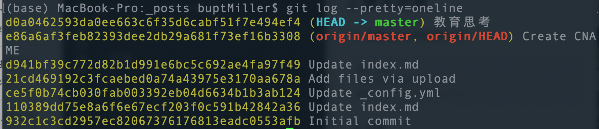
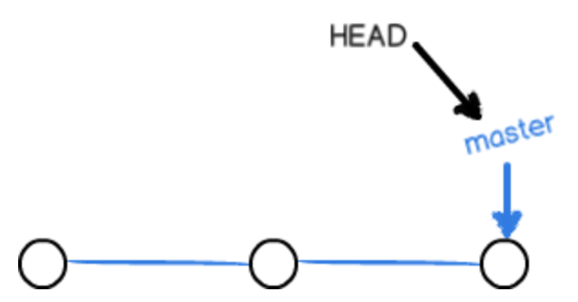
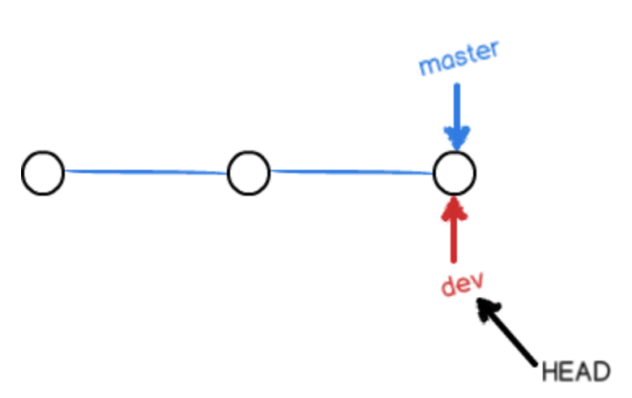
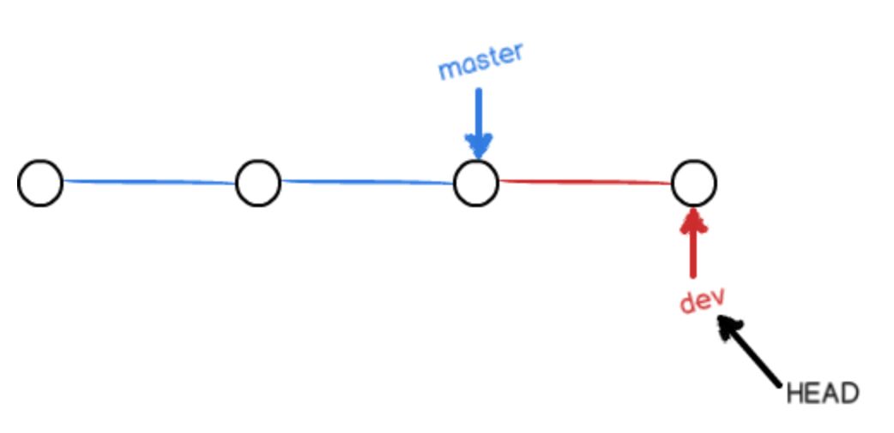
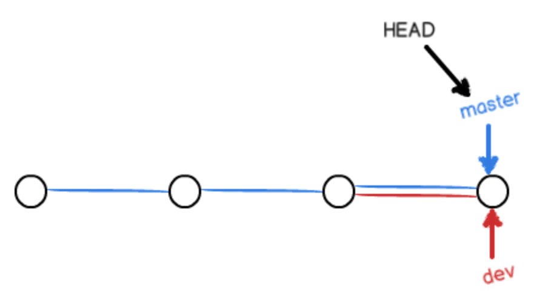
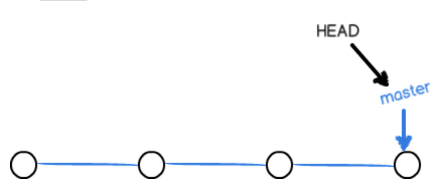
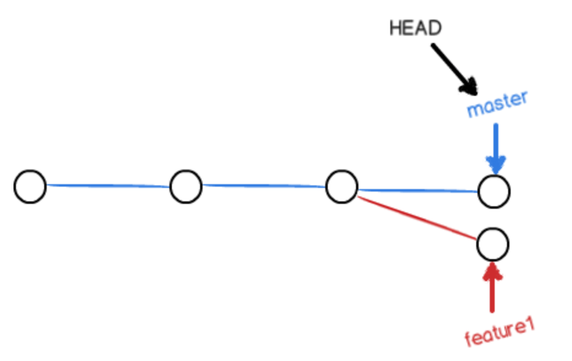
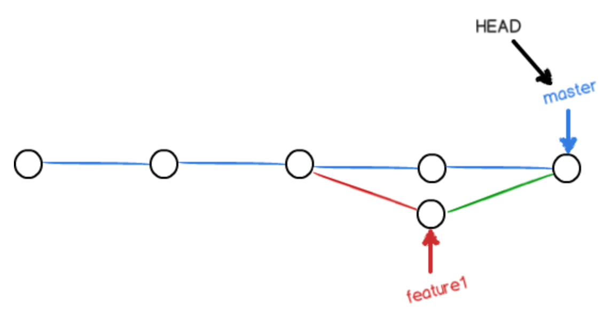
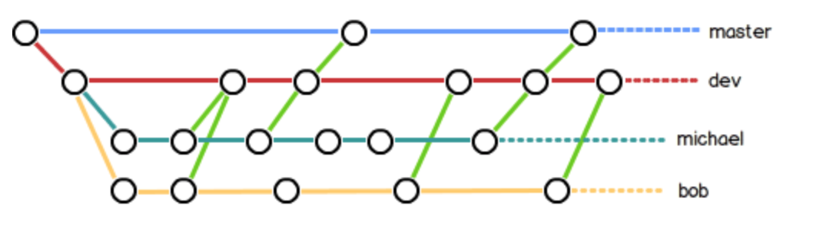

# git

## 1.git 基本
- 克隆某个仓库（git init完毕）
```
$ git clone [link]
```
克隆仓库后，自动把本地的master和远程的master对应起来了，并且远程仓库名默认为origin,查看远程仓库名称为：

```
$ git remote
origin
#或者更详细的信息
$ git remote -v
origin  git@github.com:michaelliao/learngit.git (fetch)
origin  git@github.com:michaelliao/learngit.git (push)
```


- 创建repositories，为工作区
```
$ git init
```
- 从工作区添加修改的文件到暂存区stage
```
$ git add [修改的文件名]
```
- commit修改到版本库
```
$ git commit -m "文件提交说明"
```
- 查看当前仓库的状态
```
$ git status
```
- 查看工作区的文件和版本库中某个文件的不同点

```
# 如：[指针]：HEAD针，[文件名]:readme.txt
$ git diff [指针] -- [文件名]
```

## 2.版本回退
- 查看commit的历史记录

```
$ git log
#或者更直观的描述方式
$ git log --pretty=oneline
```

从下往上依次commit, 最新的一次commit在最上面。前面的为commit的ID。

- 回退

```
#回到上个版本
$ git reset --hard HEAD^
#回到上上个版本
$ git reset --haed HEAD^^
#回到指定的ID版本，这个操作可以用于回退再往前
$ git reset --hard d0a046
#如果找不到commit ID的话，可以用
$ git reflog
```

- 撤销修改

```
# 撤销工作区文件的修改，这种修改未添加到暂存区
#1. 工作区的修改未add, 则下面的代码回到上次commit的状态
#2. 文件的一部分已经添加到暂存区，则下则的命令回到修改前的状态，但是暂存区还存在已经add结束的，总结一句话是回到上次add的状态
$ git checkout -- [文件名]

# 插销暂存区的修改，修改已经存放到暂存区了，其实是从HEAD中reset了
#[指针]：HEAD, [文件名]:readme.txt
$ git reset [指针] [文件名]
```
- 删除文件

```
#1.对于已经在版本库中的文件进行删除
$ git rm [文件名]
$ git commit -m [字符串说明]
#2.另一种是将版本库中的版本还原到工作区,checkout的作用其实是将版本库中的数据替换工作区中的数据，"一键还原"。
$ git checkout -- [文件名]
```

## 远程仓库
- 添加到远程仓库
```
$ git push origin master
```

## 分支管理
- 创建与合并分支
1. 主分支master, HEAD指向master。

2. 创建了一个dev分支，HEAD指向dex。
```
$ git switch -c dev
#相当于
$ git branch dev
$ git switch dev
```

3. 在dev分支上commit了一个，向前走一步。  

```
#查看当前分支, 星号代表当前分支
$ git branch
* dev
  master
```


4. master分支向前提交。

```
#切换到主master分支
$ git switch master
# 合并dev分支
$ git merge dev
```

5. dev分支消失

。

```
#删除分支
$ git branch -d dev
```
- 解决冲突
1. 冲突发生如下图所示，feature1和master上都进行了commit, 修改了不同的内容（不同文件或者同一个文件的不同内容），致使无法合并，这个也是符合逻辑的。

```
#切换到master后
$ git merge feature1
Auto-merging readme.txt
CONFLICT (content): Merge conflict in readme.txt
Automatic merge failed; fix conflicts and then commit the result.
```

```
#查看状态存在冲突
$ git status
On branch master
Your branch is ahead of 'origin/master' by 2 commits.
  (use "git push" to publish your local commits)

You have unmerged paths.
  (fix conflicts and run "git commit")
  (use "git merge --abort" to abort the merge)

Unmerged paths:
  (use "git add <file>..." to mark resolution)

	both modified:   readme.txt

no changes added to commit (use "git add" and/or "git commit -a")
```



2. 通过手动修改dev上的内容使其和master上的相同的图如下（这种好蠢）


```
#手动改之后的log graph图像
$ git log --graph --pretty=oneline --abbrev-commit
*   cf810e4 (HEAD -> master) conflict fixed
|\  
| * 14096d0 (feature1) AND simple
* | 5dc6824 & simple
|/  
* b17d20e branch test
* d46f35e (origin/master) remove test.txt
* b84166e add test.txt
* 519219b git tracks changes
* e43a48b understand how stage works
* 1094adb append GPL
* e475afc add distributed
* eaadf4e wrote a readme file
```
- 分支管理策略
Fast forward这种模式下，删除分支，会丢失分支信息，若想保留分支信息，用--no-ff的方式（会在master上形成一个行的commit）进行git merge。

```
$ git merge --no-ff -m "merge with no-ff" dev
Merge made by the 'recursive' strategy.
 readme.txt | 1 +
 1 file changed, 1 insertion(+)
```

```
$ git log --graph --pretty=oneline --abbrev-commit
*   e1e9c68 (HEAD -> master) merge with no-ff
|\  
| * f52c633 (dev) add merge
|/  
*   cf810e4 conflict fixed
...
```


平时开发中，master是稳定的发行版本的分支，一般工作不在这上面进行，一般在dev上进行开发，最后往master上merge发行，所以个人都是从dev上出分支进行开发的，如下图所示：


- bug分支  
master主分支，dev从master上而来，然后在你在dev分支上做作业的时候，有个master上的bug急需要解决，但是dev上的作业还没做完，这个时候需要你保存dev作业现场，然后转到master分支上，从master分支上开一个小分支来解决bug，再merge回master, 然后因为dev继承自master，所以dev上很可能也存在此bug, 这就需要bug分支同样的操作应用到dev上，代码如下：
1. 保存dev的现场

```
$ git stash
Saved working directory and index state WIP on dev: f52c633 add merge
```

2. 回到master分支，并创建bug分支

```
# switch也行
$ git checkout master
Switched to branch 'master'
Your branch is ahead of 'origin/master' by 6 commits.
  (use "git push" to publish your local commits)
# bug分支名为 issue-101
$ git checkout -b issue-101
Switched to a new branch 'issue-101'
```

3. 解决bug, merge回master

```
#经过在issue-101上一系列的add, commit后
$ git switch master
Switched to branch 'master'
Your branch is ahead of 'origin/master' by 6 commits.
  (use "git push" to publish your local commits)

$ git merge --no-ff -m "merged bug fix 101" issue-101
Merge made by the 'recursive' strategy.
 readme.txt | 2 +-
 1 file changed, 1 insertion(+), 1 deletion(-)
# 删除分支
$ git branch -d issue-101
# 若git提示分支还没commit，可以强制删除
git branch -D issue-101
```

4. 转回dev分支，恢复现场

```
$ git stash list
stash@{0}: WIP on dev: f52c633 add merge

#恢复现场的方法有两种，一种是git stash apply, 但是恢复后stash不删除，需要手动git stash drop来删除；另一种是git pop, 恢复加删除
$ git stash pop
On branch dev
Changes to be committed:
  (use "git reset HEAD <file>..." to unstage)

	new file:   hello.py

Changes not staged for commit:
  (use "git add <file>..." to update what will be committed)
  (use "git checkout -- <file>..." to discard changes in working directory)

	modified:   readme.txt

Dropped refs/stash@{0} (5d677e2ee266f39ea296182fb2354265b91b3b2a)

#当有多次stash的时候，可用
git stash apply stash@{0}
```

5. 将bug分支同样的操作运用到dev上

```
# 其中 4c805e2是在bug分支上的commit ID
$ git branch
* dev
  master
# 这个操作也会形成新的commit ID。
$ git cherry-pick 4c805e2
[master 1d4b803] fix bug 101
 1 file changed, 1 insertion(+), 1 deletion(-)
```
- 多人协作  
1. 默认情况下拉取的只有master分支，可以用如下进行查看：
```
$ git branch
* master
```
若想拉取远程的dev分支，可以用：

```
$ git checkout -b dev origin/dev
```
2. 可以试图git push origin <branch-name>推送自己的分支;
2. 如果推送失败，则因为远程分支比你的本地更新（其他的小伙伴拉取了分支并push了上去，就无法形成同步了），需要先用git pull试图合并；
3. 如果合并有冲突，则解决冲突，并在本地提交；
4. 没有冲突或者解决掉冲突后，再用git push origin <branch-name>推送就能成功！
5. 如果git pull提示no tracking information，则说明本地分支和远程分支的链接关系没有创建，用命令git branch --set-upstream-to <branch-name> origin/<branch-name>。

```
$ git pull
There is no tracking information for the current branch.
Please specify which branch you want to merge with.
See git-pull(1) for details.

    git pull <remote> <branch>

If you wish to set tracking information for this branch you can do so with:

    git branch --set-upstream-to=origin/<branch> dev
```
- 标签

```
# 默认标签是打在最新的一次commit上
$ git tag
# 这种标签是打在确定的commit ID上
$ git tag v0.9 f52c633
# -a指定标签名，-m:说明
$ git tag -a v0.1 -m "version 0.1 released" 1094adb
# 显示标签的信息
$ git show v0.1
# 删除标签
$ git tag -d v0.1
# 远程推送标签
$ git push origin v1.0
# 远程一次性推送全部的标签
$ git push origin --tags
# 如果想删除已经推送到远程的标签
$ git tag -d v0.9 #先本地删除
$ git push origin :refs/tags/v0.9 #远程删除
```

[廖雪峰git](https://www.liaoxuefeng.com/wiki/896043488029600)  
[图解git](http://marklodato.github.io/visual-git-guide/index-zh-cn.html)  
[简易git](http://rogerdudler.github.io/git-guide/index.zh.html)

[面试总结的git](<https://cyc2018.github.io/CS-Notes/#/notes/Git>)